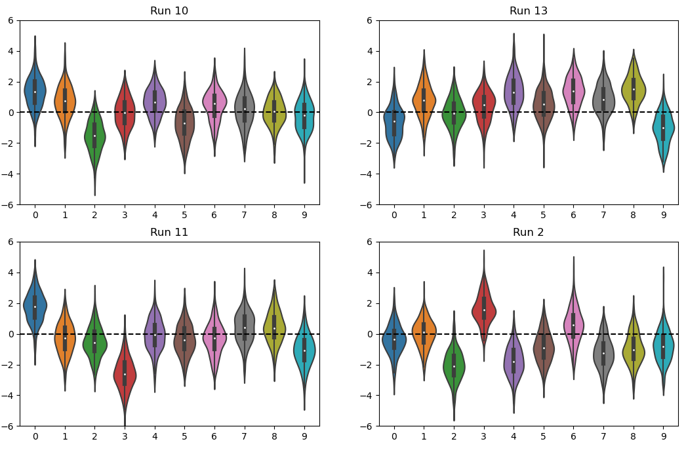
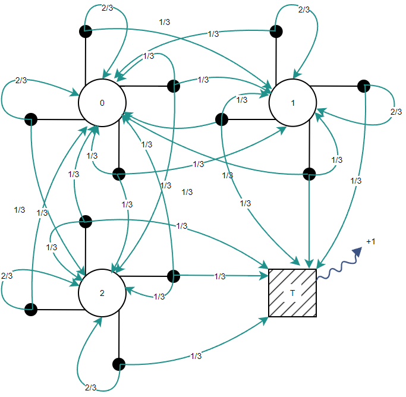
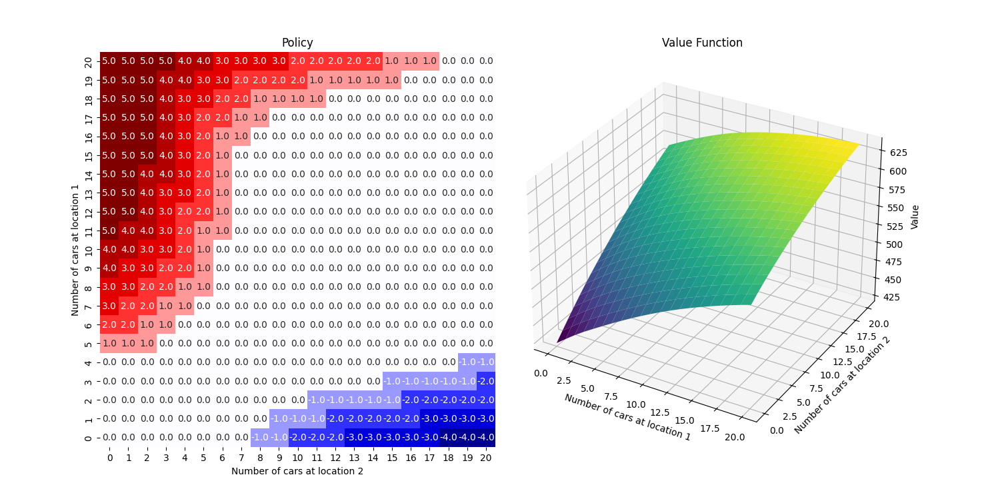
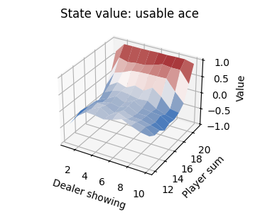
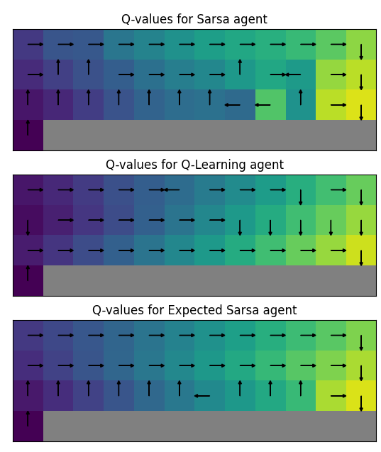
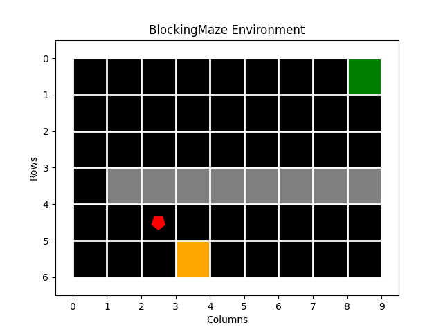

# RL Fundamentals

This repository contains the reference implementations, assignments, and exercises for the Udemy course _Introduction to Reinforcement Learning_.

## Repository structure

- `assignments/`: student-facing assignment briefs.
- `checks/`: beginner-friendly self-check commands for each topic.
- `exercises/`: smaller guided exercises and side explorations.
- `images/`: figures used in the course and assignment notes.
- `rl/`: the main algorithm and environment implementations.
- `utils/`: maintainer utilities, including student-repo generation.

## What you'll implement

| Topic | [K-Armed Bandits](assignments/bandits.md) | [Analytic solutions to MDPs](assignments/markov_decision_processes.md) | [Dynamic Programming](assignments/dynamic_programming.md) |
|:--|:--:|:--:|:--:|
| Preview |  |  |  |
| Algorithms | Investigate epsilon-greedy and optimistic initial values. | Express Bellman equations as simultaneous equations and solve them with `numpy.linalg`. | Implement policy iteration and value iteration. |
| Environments | Sutton & Barto k-armed bandit testbed | [Frozen Lake](https://gymnasium.farama.org/environments/toy_text/frozen_lake/) | Jack's Car Rental |

| Topic | [Monte Carlo](assignments/monte_carlo.md) | [Temporal Difference](assignments/temporal_difference.md) | [Planning](assignments/planning.md) |
|:--|:--:|:--:|:--:|
| Preview |  |  |  |
| Algorithms | Implement first-visit MC prediction and MC control. | Implement Sarsa, Q-learning, and Expected Sarsa. | Implement Dyna-Q and Dyna-Q+. |
| Environments | [Blackjack](https://gymnasium.farama.org/environments/toy_text/blackjack/) | [Cliff Walking](https://gymnasium.farama.org/environments/toy_text/cliff_walking/) | Planning mazes |

## Python version

Use **Python 3.11** for this repo.

The dependency pins in this course are intentionally conservative so the algorithms and plots stay stable. Newer Python versions, especially 3.12+ and 3.13+, are not the target for this course repo and may fail to install some of the older numerical packages in this project.

## Quick start with `uv`

Run all commands from the repository root.

1. Install [uv](https://docs.astral.sh/uv/).
2. Make sure Python 3.11 is available.

   If you do not already have it, install it with:

   ```bash
   uv python install 3.11
   ```

3. Sync the environment:

   ```bash
   uv sync --python 3.11
   ```

4. Run an assignment script:

   ```bash
   uv run python -m rl.experiments.temporal_difference.cliff_walking_learning_curves
   ```

5. Run a student self-check:

   ```bash
   uv run python -m checks.temporal_difference
   ```

You do not need to edit `PYTHONPATH` if you run commands from the repo root.

## Pip fallback

If `uv` is not available on your machine, use the standard `venv` + `pip` flow instead.

1. Create a Python 3.11 virtual environment.

   Windows:

   ```bash
   py -3.11 -m venv .venv
   ```

   macOS/Linux:

   ```bash
   python3.11 -m venv .venv
   ```

2. Activate it.

   Windows:

   ```bash
   .venv\Scripts\activate
   ```

   macOS/Linux:

   ```bash
   source .venv/bin/activate
   ```

3. Install dependencies:

   ```bash
   pip install -r requirements.txt
   ```

4. Run the same module commands:

   ```bash
   python -m rl.experiments.temporal_difference.cliff_walking_learning_curves
   python -m checks.temporal_difference
   ```

## Student self-checks

Each topic has a lightweight local checker. They are designed to be more helpful than a raw traceback and more precise than comparing plots by eye.

Available commands:

- `python -m checks.bandits`
- `python -m checks.markov_decision_processes`
- `python -m checks.dynamic_programming`
- `python -m checks.monte_carlo`
- `python -m checks.temporal_difference`
- `python -m checks.planning`

Run `python -m checks` to see the full list and a short description of each command.

## Working through the course

1. Open the relevant brief in `assignments/`.
2. Implement the code inside the marked homework or assignment regions.
3. Run the matching `checks.*` command.
4. Run the experiment script for that topic and compare the broad shape of the result to the course notes.

## Additional resources

- Sutton, R. S., & Barto, A. G. (2018). _Reinforcement Learning: An Introduction_ (Second Edition).
- [Gymnasium documentation](https://gymnasium.farama.org/)
- [NumPy documentation](https://numpy.org/doc/)
- [Pandas documentation](https://pandas.pydata.org/docs/)
- [Matplotlib documentation](https://matplotlib.org/stable/)

## Contact

For course questions or issues, contact [Tom Walker](mailto:tom.walker.univ@gmail.com).
