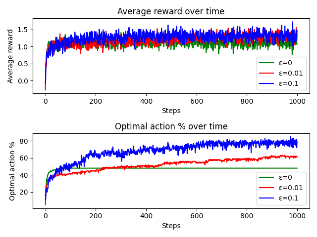
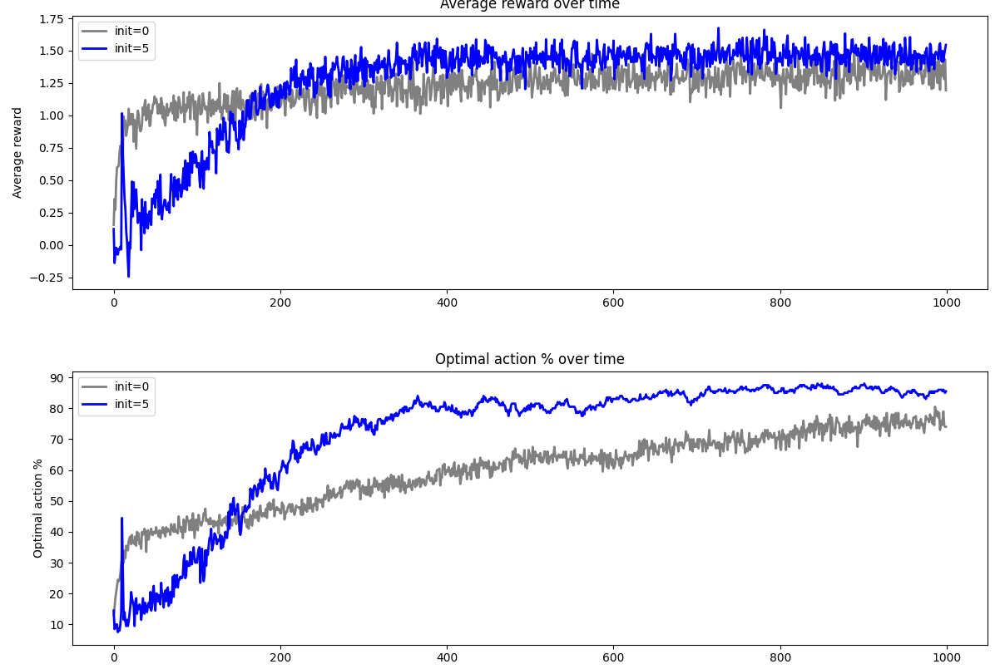

# Assignment: Epsilon-Greedy Algorithm and Random Tie-Breaking

## Overview

In this assignment, you will implement the epsilon-greedy algorithm for the k-armed bandit problem and the `argmax_ties_random` function for random tie-breaking. This exercise will help you understand the exploration-exploitation trade-off and the importance of handling ties in action selection. You will also explore the effects of different initializations and epsilon values on the agent's performance through experiments.

## Objectives

- Implement the epsilon-greedy action selection strategy.
- Implement the `argmax_ties_random` function to handle ties randomly.
- Understand the impact of different epsilon values on the agent's performance.
- Implement the weighted update method for action-value estimates.
- Explore the effect of optimistic initial values on the agent's performance.
- Run experiments to observe and analyze the agent's behavior under various settings.

## Files to Work On

- `rl/utils/general.py`
  - **Function to Implement:**
    - `argmax_ties_random`
- `rl/algorithms/bandits/epsilon_greedy.py`
  - **Methods to Complete:**
    - `act`
    - `simple_update`
    - `weighted_update` (for later)

## Instructions

### Step 1: Implement Functions/Methods for `epsilon_sweep_experiment` and Run the Experiment

In this step, you will implement the necessary functions and methods to run the `epsilon_sweep_experiment`. This experiment will help you understand how different epsilon values affect the agent's performance.

#### 1. Implement `argmax_ties_random` in `general.py`

Navigate to `rl/utils/general.py` and locate the `argmax_ties_random` function marked with `# HOMEWORK`. Implement the function as per the instructions.

**Hints:**

- Use a loop to find the maximum value and track indices that tie for the maximum.
- Use `np.random.choice` to randomly select one of the indices if there are ties.

#### 2. Complete the `act` Method in `EpsilonGreedy` Class

In `rl/algorithms/bandits/epsilon_greedy.py`, locate the `act` method marked with `# HOMEWORK`. Implement the epsilon-greedy action selection:

- With probability `epsilon`, select a random action.
  - Use `np.random.randint` with the number of actions as the upper bound.
- With probability `1 - epsilon`, select the action with the highest estimated value using `argmax_ties_random`.

#### 3. Complete the `simple_update` Method in `EpsilonGreedy` Class

Implement the `simple_update` method to update the action-value estimate using sample averages.

**Formula:**

Q_{n+1} = Q_n + (1 / N_n) * (R_n - Q_n)


- Increment `N(A)` for the selected action (`self.action_counts`).
- Update `self.q_values[action]` using the incremental formula.

#### 4. Run the `epsilon_sweep_experiment`

After implementing the above functions and methods, you can run the `epsilon_sweep_experiment` to observe the agent's performance with different epsilon values.

**Steps:**

1. Open `rl/algorithms/bandits/epsilon_greedy.py`.
2. In the `if __name__ == "__main__":` block, uncomment the following line to run the epsilon sweep experiment:

   ```python
   # Epsilon Sweep Experiment
   epsilon_sweep_experiment()
3. Run the script:

   ```bash
   python rl/algorithms/bandits/epsilon_greedy.py
   ```

4. Observe the plotted results showing average rewards and optimal action percentages over time for different epsilon 
values.

### Step 2: Implement the Remaining Method for initial_val_experiment and Run the Experiment
In this step, you will implement the weighted_update method to prepare for the initial_val_experiment. This experiment explores the effect of optimistic initial values on the agent's performance.

1. Complete the `weighted_update` Method in `EpsilonGreedy` Class
    1. Implement the weighted_update method to update the action-value estimate using a constant step size (alpha).

    2. (Formula: Q_{n+1} = Q_n + α * (R_n - Q_n))
    3. Update self.q_values[action] using the weighted average formula with step size alpha.
2. Run the initial_val_experiment
    1. After implementing the `weighted_update method`, you can run the initial_val_experiment to observe the effect of 
   optimistic initial values.

## Running an Experiment:

1. Open rl/algorithms/bandits/epsilon_greedy.py.

2. In the `if __name__ == "__main__"`: block, uncomment one of the following lines to run the experiment with desired 
options:
  ```python
  # Run with default settings
  initial_val_experiment()
  
  # Run showing individual runs
  # initial_val_experiment(show_individual_runs=True)
  
  # Run showing confidence intervals
  # initial_val_experiment(show_confidence_interval=True)
  
  # Run showing individual runs and confidence intervals
  # initial_val_experiment(show_individual_runs=True, show_confidence_interval=True)
  ```

3. Run the script:

```bash
python rl/algorithms/bandits/epsilon_greedy.py
```

4. Observe the plotted results demonstrating the effect of different initialisation strategies on the agent's 
performance.

## Expected outputs

### Epsilon Sweep Experiment


### Initial Value Experiment



## Additional Resources
- Sutton, R. S., & Barto, A. G. (2018). Reinforcement Learning: An Introduction (Second Edition). Chapter 2.
- NumPy Documentation:
    - np.max
    - np.where
    - np.random.choice
    - np.random.randint

## Notes
- Make sure to set the random seed as provided to ensure reproducible results.
- Pay attention to the use of vectorized operations with NumPy for efficiency.
- If you encounter any issues, double-check your implementations and consult the resources provided.
- Experiment with different epsilon values and initialisation strategies to deepen your understanding.
- Ensure that you have all the necessary dependencies installed, such as NumPy, Pandas, Matplotlib, and SciPy.

---

Good luck with your assignment!