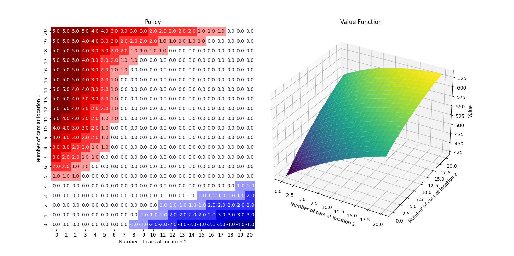

# Assignment: Policy Iteration and Value Iteration


## Overview
- In this assignment, you will implement the Policy Iteration and Value Iteration algorithms to solve a dynamic 
programming problem in reinforcement learning.
- You will work with Jack's Car Rental problem, a classic example from Sutton and Barto's book. 
- Through this exercise, you will gain a deeper understanding of how these algorithms compute the optimal policy and 
  value function for Markov Decision Processes (MDPs).

## Objectives
- Implement the **Policy Iteration** algorithm.
- Implement the **Value Iteration** algorithm.
- Understand how dynamic programming methods solve MDPs.
- Analyse the convergence and performance of the algorithms.
- Visualise the optimal policy and value function.

## Files to Work On
- `rl/algorithms/dynamic_programming/policy_iteration.py`
    - Methods to Complete:
        - policy_evaluation
        - policy_improvement
        - policy_iteration
- `rl/algorithms/dynamic_programming/value_iteration.py`
    - Method to Complete:
        - value_iteration

---

## Instructions

### Step 1: Policy Iteration

Within the `rl/algorithms/dynamic_programming/policy_iteration.py` module:

1. **Implement the `policy_evaluation` method**
   - Refer back to the lecture pseudocode
   - Comments guide you line-by-line through the algorithm

2. **Implement the `policy_improvement`method**

3. **Inspect the rest of the code**
   - Familiarise yourself with the `policy_iteration` method
   - (Stretch) understand how the Jack's Car Rental problem is modelled efficiently in the code
       - c.f. the lecture on Jack's Car Rental implementation

4. **Run `policy_iteration`:**
   - Execute the script (from the root directory in the terminal):
     ```bash
     python -m rl.algorithms.dynamic_programming.policy_iteration
     ```

### Step 2: Value Iteration

Within the `rl/algorithms/dynamic_programming/value_iteration.py` module:

1. **Implement the `value_iteration` method**
   - Refer back to the lecture pseudocode
   - Comments guide you line-by-line through the algorithm

2. **Run `value_iteration`:**
   - Execute the script (from the root directory in the terminal):
     ```bash
     python -m rl.algorithms.dynamic_programming.value_iteration
     ```

## Expected Outputs

### Policy iteration


 - *LH plot: If there is a mismatch between cars at one location and cars at another, 
policy increasingly recommends redistributive actions (+ve going from loc 1 to loc 2; -ve going from loc 2 to loc 1)*
 - *RH plot: value (= expected future return) greatest when there is ample cars at both locations - no risk of 
   "demand censoring")*

### Value iteration



 - *Very similar results to policy iteration. Value iteration is more computationally efficient, but policy iteration 
   is more stable.*
---

## Additional Resources

- Sutton & Barto (2018): Reinforcement Learning: An Introduction (Second Edition), Chapter 4
    - Covers the theory behind dynamic programming methods
    - Introduces Jack's Car Rental problem
- Dynamic programming: Lecture Notes
- NumPy Documentation:
    - `np.argmax`
    - `np.max`

## Notes

- Dependencies:
    - Ensure NumPy and Matplotlib are installed.
- Validation:
    - Compare outputs from both algorithms to validate implementations.

---
Good luck with your assignment!
