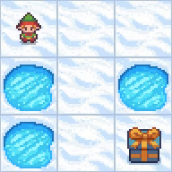
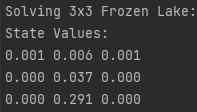
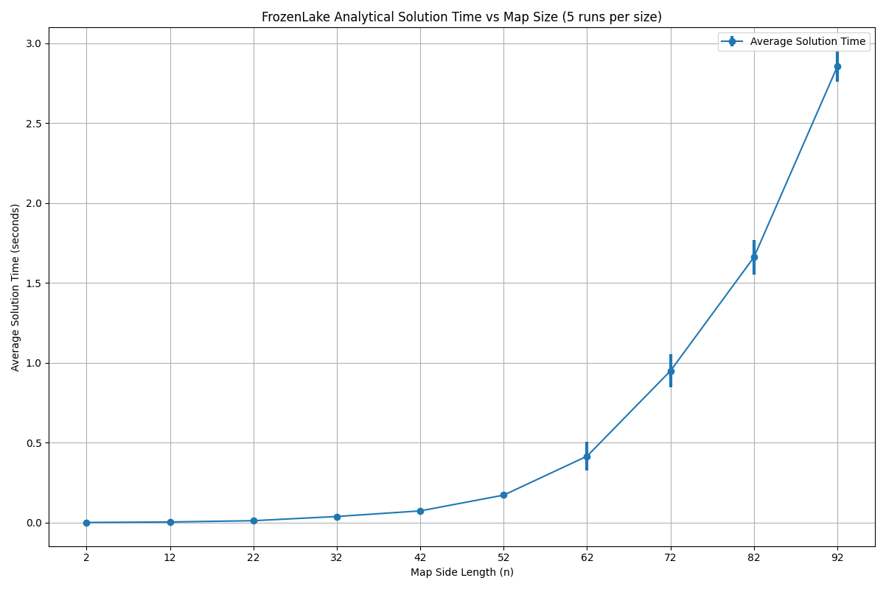

# Assignment: FrozenLake GridWorlds

|                       Solve a 2x2 env analytically                       |                       Solve a 3x3 env analytically                       |
|:------------------------------------------------------------------------:|:------------------------------------------------------------------------:|
|  |  |

## Overview

In this assignment, you will explore the analytical and computational aspects of Markov Decision Processes (MDPs) using the FrozenLake environment from OpenAI's Gymnasium library. The assignment is divided into two investigations:

1. **Analytical Solution of FrozenLake GridWorlds:** Implement and solve the FrozenLake environment analytically for 2x2 and 3x3 grid sizes by constructing and solving corresponding linear systems. This exercise will deepen your understanding of MDPs and their mathematical foundations.

2. **Performance Sweep over Varying Grid Sizes:** Execute a performance sweep to analyze how the solution time scales with increasing grid sizes. This investigation involves running predefined scripts to gather and visualize performance data, providing insights into the computational complexity of solving MDPs analytically.

## Objectives

- **Understand MDPs:** Grasp the fundamental concepts of Markov Decision Processes and their application in gridworld environments.
- **Analytical Solutions:** Learn to construct and solve linear systems representing MDPs for small gridworlds.
- **Performance Analysis:** Explore how computational performance varies with the size of the gridworld.
- **Data Visualization:** Utilize Matplotlib to plot and interpret performance metrics with error bars indicating variability.
- **Hands-On Experience:** Gain practical experience with Gymnasium environments, NumPy for linear algebra, and Python scripting for experiments.

## Files to Work On

- `exercises/mdps/frozen_lake_investigation_1.py`
  - **Functions to Implement:**
    - `solve_two_by_two()`
    - `solve_three_by_three()`
- `exercises/mdps/frozen_lake_investigation_2.py`
  - **Functionality:**
    - Perform a sweep over different map sizes, solve them, measure solution times, and plot the results.

---

## Instructions

### Step 1: Analytical Solution of 2x2 and 3x3 FrozenLake Maps

1. **Implement `solve_two_by_two` and `solve_three_by_three` Functions in `frozen_lake_investigation_1.py`:**
   - **Objective:** Construct and solve the linear systems representing the MDPs for 2x2 and 3x3 FrozenLake grids.
   - **Tasks:**
     - **`solve_two_by_two()`:**
       - Define the transition matrix `A` and reward vector `b` for the 2x2 grid.
       - Solve the linear system to obtain state values `v`.
     - **`solve_three_by_three()`:**
       - Define the transition matrix `A` and reward vector `b` for the 3x3 grid.
       - Solve the linear system to obtain state values `v`.
   - **Hints:**
     - The 2x2 case was covered in the lectures, so refer to that if you get stuck
     - The 3x3 case is new. It might help to sketch out the transition diagram on paper.
     - Holes are terminal states with reward 0. The goal state is a terminal state with reward 1.
     - You can derive simultaneous equations for only the non-terminal states 
     - (which means 5 states for this grid: 1 goal and 3 holes = 4 terminal states.)

2. **Run the Analytical Solution:**
   - **Objective:** Execute the script to compute and display state values for both grid sizes.
   - **Tasks:**
     - Ensure your implementation is complete and save `frozen_lake_investigation_1.py`.
     - Run the script from the root directory:
       ```bash
       python -m exercises.mdps.frozen_lake_investigation_1 solve
       ```
   - **Observe:** The printed state values for both 2x2 and 3x3 grids, ensuring terminal states are correctly represented.
     <br><br>
   
|                            Solve a 2x2 env analytically                            |                            Solve a 3x3 env analytically                            |
|:----------------------------------------------------------------------------------:|:----------------------------------------------------------------------------------:|
|            |            |
|  |  |

### Step 2: Performance Sweep over Varying Grid Sizes

1. **Run the Performance Sweep Script:**
   - **Objective:** Analyze how the solution time scales with increasing grid sizes.
   - **Tasks:**
     - Investigate `exercises.mdps.frozen_lake_investigation_2`
     - This script derives the A and b matrices for different grid sizes automatically, solves the linear system, and 
     measures the solution time.
     - You can check it gets the same results as your manual calculations via:
     - ```bash
       python -m exercises.mdps.frozen_lake_investigation_2 solve
       ```
     - But its main function is to perform a sweep over different grid sizes and plot the results (see below)
   - **Run:**
     - Navigate to the root directory of your repository.
     - Execute the sweep:
       ```bash
       python -m exercises.mdps.frozen_lake_investigation_2 sweep
       ```
     - **Observe:** The script will perform multiple runs for each grid size, measure solution times, and plot the results with error bars indicating standard deviation over runs.

    <br><br>
    
    
    - *Sweep of different map sizes from 2x2, increasing in steps of 10, e.g. 12x12, 22x22...*
    - *Randomly generated maps, so results averaged over 5 runs per side length*
    - *Matrix inversion techniques like `np.linalg` should solve in time ~ O(num_states^3)*
    - *i.e. time ~ O(side_length^6) (although holes reduce this)*

## Additional Resources

- Sutton & Barto (2018): Reinforcement Learning: An Introduction (Second Edition), Chapter 3
    - Covers the theory finite MDPs and Bellman equations
- MDPs: Lecture Notes (the 2x2 case was covered in the lectures)
- Gymnasium Frozen Lake documentation: https://gymnasium.farama.org/environments/toy_text/frozen_lake/

---
Good luck with your assignment!