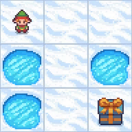
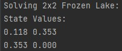
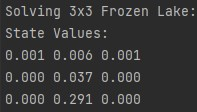
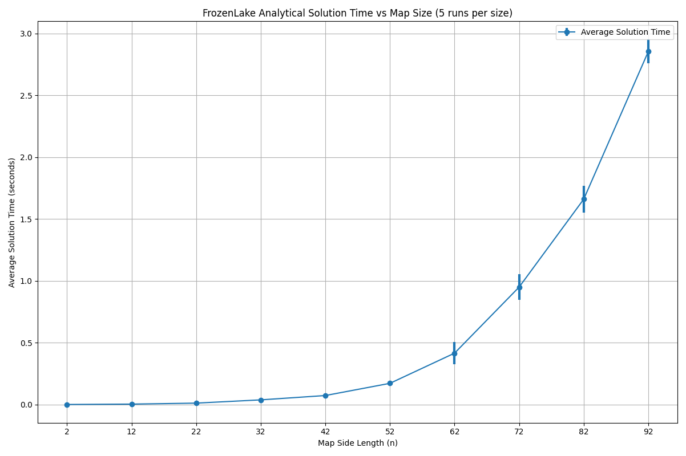

# Assignment: FrozenLake GridWorlds

|                       Solve a 2x2 env analytically                       |                       Solve a 3x3 env analytically                       |
|:------------------------------------------------------------------------:|:------------------------------------------------------------------------:|
|  |  |

## Overview

In this assignment, you will explore the analytical and computational aspects of Markov Decision Processes (MDPs) using the FrozenLake environment from Gymnasium. The assignment is divided into two investigations:

1. **Analytical Solution of FrozenLake GridWorlds:** Implement and solve the FrozenLake environment analytically for 2x2 and 3x3 grid sizes by constructing and solving the corresponding linear systems.
2. **Performance Sweep over Varying Grid Sizes:** Execute a performance sweep to analyse how solve time scales with increasing grid sizes.

## Objectives

- Understand the Bellman-equation view of small MDPs
- Construct and solve the linear systems for 2x2 and 3x3 FrozenLake problems
- Explore how computational cost grows with grid size
- Interpret the resulting plots and timings

## Files to Work On

- `exercises/mdps/frozen_lake_investigation_1.py`
  - `solve_two_by_two()`
  - `solve_three_by_three()`
- `exercises/mdps/frozen_lake_investigation_2.py`
  - Performance sweep and visualisation

---

## Instructions

### Read the file layout first

`exercises/mdps/frozen_lake_investigation_1.py` is a reference-style file.

- Only edit code inside `# ASSIGNMENT START` / `# ASSIGNMENT END` blocks.
- Ignore any `# SOLUTION START` / `# SOLUTION END` blocks in the reference repo.
- If you are working in a generated student repo, those solution blocks should already be removed for you.

### Step 1: Analytical solution of 2x2 and 3x3 FrozenLake maps

1. **Implement `solve_two_by_two()` and `solve_three_by_three()` in `frozen_lake_investigation_1.py`.**
   - Construct the linear systems `A v = b` for the equiprobable policy.
   - The 2x2 case was covered in the lectures, so use that as the template.
   - For the 3x3 case, it helps to sketch the state transitions on paper first.
   - Holes are terminal states with reward 0. The goal state is terminal with reward 1.
   - You only need simultaneous equations for the non-terminal states.

2. **Run the analytical solution.**
   - If you are using `uv`:
     ```bash
     uv run python -m exercises.mdps.frozen_lake_investigation_1 solve
     ```
   - If you are using the pip fallback environment from the README, run the same command without `uv run`.

3. **Check the output.**
   - The printed values should be finite and the terminal-state structure should make sense.
   - The 3x3 system is larger, but it follows the same Bellman-equation logic as the 2x2 case.

|                            Solve a 2x2 env analytically                            |                            Solve a 3x3 env analytically                            |
|:----------------------------------------------------------------------------------:|:----------------------------------------------------------------------------------:|
|            |            |
|  |  |

### Step 2: Performance sweep over varying grid sizes

1. **Inspect `exercises.mdps.frozen_lake_investigation_2`.**
   - This script derives the `A` and `b` matrices for different grid sizes automatically.
   - It can reproduce the same 2x2 and 3x3 answers programmatically.

2. **Optionally verify the solver path.**
   - If you are using `uv`:
     ```bash
     uv run python -m exercises.mdps.frozen_lake_investigation_2 solve
     ```

3. **Run the sweep.**
   - If you are using `uv`:
     ```bash
     uv run python -m exercises.mdps.frozen_lake_investigation_2 sweep
     ```
   - If you are using the pip fallback environment from the README, run the same command without `uv run`.

4. **Interpret the result.**
   - The plot shows how solution time grows as the map gets larger.
   - Matrix inversion via `np.linalg.solve` should scale roughly like `O(num_states^3)`.
   - For an `n x n` grid, that means growth on the order of `O(n^6)` before accounting for terminal holes.



*Sweep of different map sizes from 2x2 upward, averaged over multiple random maps.*

## Additional Resources

- Sutton & Barto (2018): Reinforcement Learning: An Introduction (Second Edition), Chapter 3
  - Finite MDPs and Bellman equations
- MDPs: Lecture Notes
- Gymnasium Frozen Lake documentation
