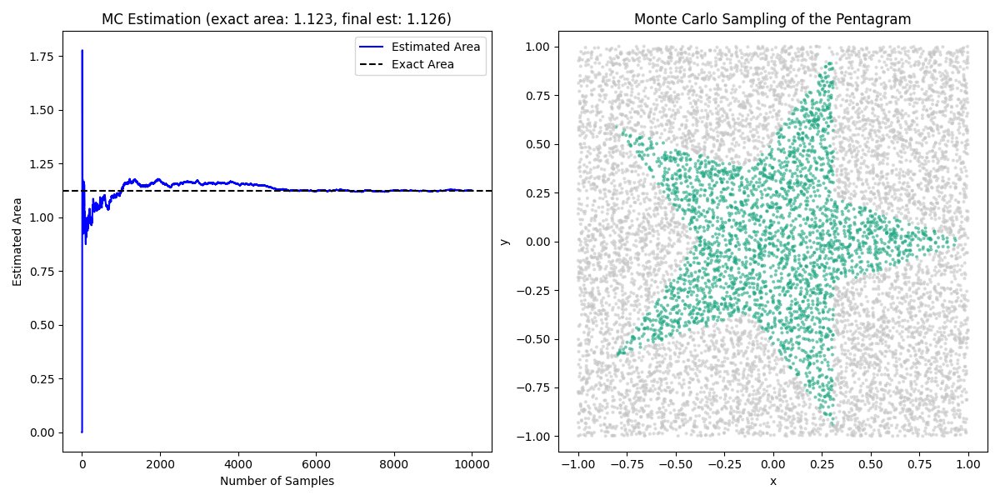

# Assignment: Monte Carlo Area Estimation



## Overview

In this assignment, you will implement and analyze a Monte Carlo simulation to estimate the area of complex geometric shapes, specifically a pentagram inscribed in a unit circle. Through this exercise, you will gain hands-on experience with Monte Carlo methods and their application in reinforcement learning contexts.

### Objectives:
- Understand the implementation of the Monte Carlo method for area estimation.
- Analyse how sample size affects the accuracy of the estimation.
- Visualise the convergence of the estimated area to the exact area.

## Files to Work On

- `exercises/monte_carlo/star_area_estimation.py`

---

## Instructions

### Step 1: Understanding the Exact Area Calculation

1. **Examine the `exact_pentagram_area` function in `monte_carlo_pentagram.py`:**
   - **Objective:** Understand how the exact area of a pentagram is calculated analytically.
   - **Tasks:**
     - Review the mathematical derivation used to compute the area.

### Step 2: Implementing the Monte Carlo Simulation

1. **Review the `is_inside_pentagram` function:**
   - **Objective:** Understand how the simulation determines whether a randomly sampled point lies inside the pentagram.
   - **Tasks:**
     - Study the geometric criteria used for point inclusion.
2. **Complete the `monte_carlo_pentagram_area` function:**
   - **HOMEWORK:**
     - **Task 1:** Input the area of the square bounding the unit circle.
     - **Task 2:** Use the helper function to check if each sampled point is inside the pentagram.
     - **Task 3:** If the point is inside, increment the `inside_count`.
     - **Task 4:** Calculate the area estimate based on the ratio of points inside to total points sampled.
     - **Task 5:** Append the current area estimate to the `area_estimates` list to track the history of estimates.

3. **Run the Monte Carlo Simulation:**
   - **Objective:** Execute the simulation to estimate the pentagram's area.
   - **Tasks:**
     - Run the script with the default number of samples:
       ```bash
       python -m exercises.monte_carlo.star_area_estimation
       ```

### Step 3: Experimentation and Exploration

1. **Vary the Number of Samples:**
   - **Objective:** Observe how changing the number of samples affects the simulation's accuracy and convergence speed.
   - **Tasks:**
     - Run the simulation with varying `num_samples` values (e.g., 1000, 5000, 10000, 20000).
     - Compare the final estimated areas and convergence plots.

2. **Stretch goal:**
   - **Task:** Modify the script to estimate the area of a different inscribed shape, such as a hexagram.
   - **Hints:**
     - Adjust the `is_inside_pentagram` function to accommodate the new shape's geometry.
     - Update the exact area calculation accordingly.

---

## Expected Outputs

### Monte Carlo Estimation Convergence


*The convergence plot shows the estimated area approaching the exact area as the number of samples increases, demonstrating the Monte Carlo method's accuracy with sufficient sampling.*

---
