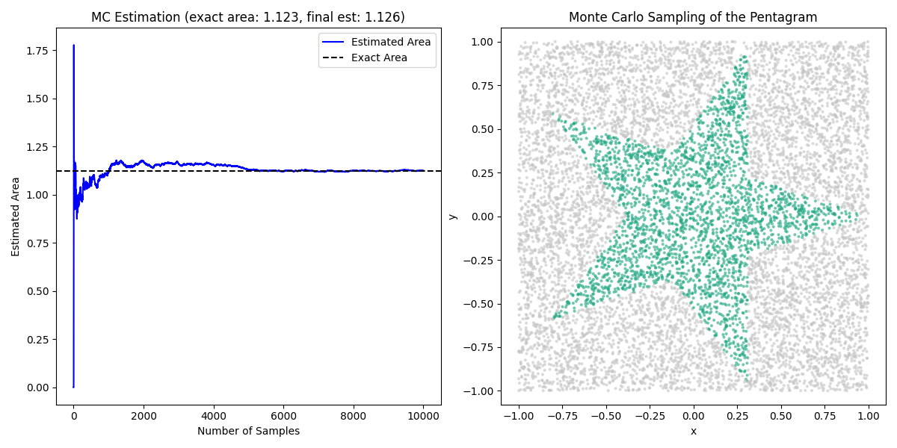

# Bonus Exercise: Monte Carlo Area Estimation



## Overview

This is an optional bonus exercise rather than a core reinforcement-learning assignment.

It uses Monte Carlo estimation to approximate the area of a pentagram inscribed in the unit circle. The point is to build intuition for sampling, convergence, and the law of large numbers in a simple geometric setting.

### Objectives
- Understand the Monte Carlo method for area estimation
- See how sample size affects accuracy and convergence
- Visualise the estimate approaching the exact answer

## File to Work On

- `exercises/monte_carlo/star_area_estimation.py`

---

## Instructions

### Step 1: Understanding the exact area calculation

1. **Examine the `exact_pentagram_area` function in `exercises/monte_carlo/star_area_estimation.py`.**
   - Understand how the exact area of the pentagram is calculated analytically.
   - This is useful context, but the main task is the Monte Carlo estimator below.

### Step 2: Implementing the Monte Carlo simulation

1. **Review the `is_inside_pentagram` function.**
   - Understand how the simulation decides whether a sampled point lies inside the pentagram.
2. **Complete the `monte_carlo_pentagram_area` function.**
   - Input the area of the square bounding the unit circle.
   - Use the helper to check whether each sampled point is inside the pentagram.
   - Increment the count for inside points.
   - Compute the area estimate from the running ratio.
   - Append each estimate to `area_estimates`.

3. **Run the simulation.**
   - If you are using `uv`:
     ```bash
     uv run python -m exercises.monte_carlo.star_area_estimation
     ```
   - If you are using the pip fallback environment from the README, run the same command without `uv run`.

### Step 3: Experimentation and exploration

1. **Vary the number of samples.**
   - Try values such as `1000`, `5000`, `10000`, and `20000`.
   - Compare the final estimates and the convergence plots.

2. **Stretch goal.**
   - Modify the script to estimate the area of a different inscribed shape, such as a hexagram.
   - Adjust both the inside-test logic and the exact-area calculation.

---

## Expected Output


*The estimated area should settle toward the exact value as the number of samples grows.*
