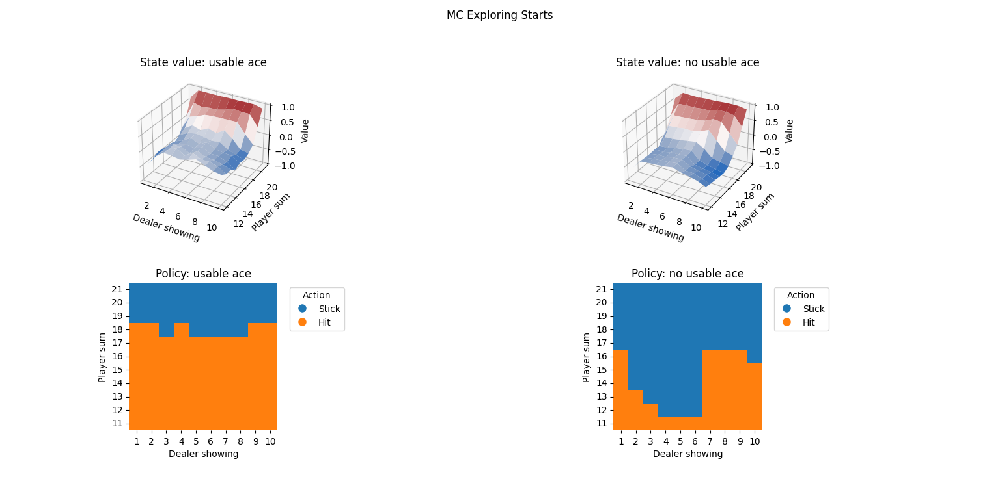
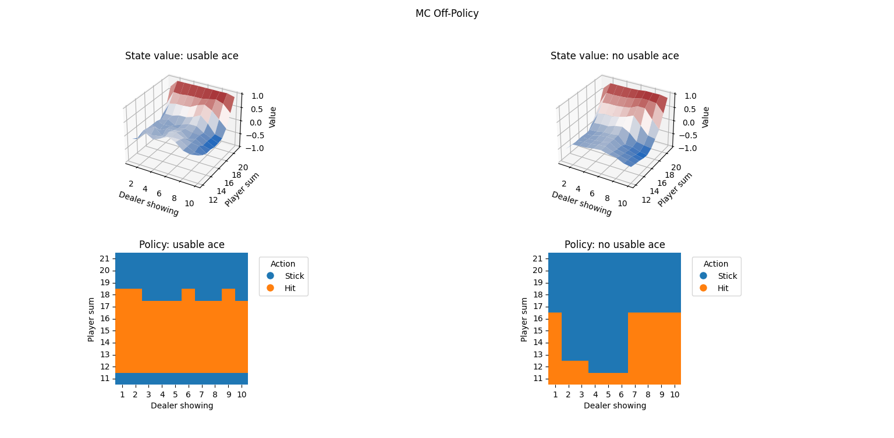

# Assignment: Monte Carlo methods

## Overview

In this assignment, you will implement Monte Carlo methods for solving reinforcement learning problems.
- You will implement Monte Carlo Exploring Starts, On-policy Monte Carlo Control, and Off-policy Monte Carlo Control.
- You will work with the Blackjack environment, a classic example from Sutton and Barto's book.
- Through this exercise, you will gain a deeper understanding of how Monte Carlo methods learn the optimal policy and value function for Markov Decision Processes (MDPs).

## Objectives

- Implement Monte Carlo Exploring Starts.
- Implement On-policy Monte Carlo Control.
- Implement Off-policy Monte Carlo Control.

## Files to Work On

- `[rl/algorithms/monte_carlo/exploring_starts.py]`
- `[rl/algorithms/monte_carlo/on_policy.py]`
- `[rl/algorithms/monte_carlo/off_policy.py]`
- `[rl/common/policy.py]`
- `[rl/algorithms/common/mc_agent.py]`
---

## Moving to Object-Oriented Programming (OOP)

TODO: Discuss motivations for moving to OOP (c.f. Bandit / Dynamic Programming repeated code).

## Instructions

<details>
<summary><h3>Step 1: Exploring Starts</h3></summary>

0. **Inspect**: You will be focussing on the `act` and `learn` methods, but inspect other methods in the 
`MCExploringStartsAgent`, along with the objects it inherits from and interacts with.
    - N.B., policy is initialised with one that sticks (0) for hands of 20 or 21, and hits (1) otherwise.
    - This is encoding environment-specific knowledge, which is specific to this Blackjack assignment.
1. **Implement `MCExploringStartsAgent.act` in `exploring_starts.py`:**
   - This is a single line of code in the method itself
   - However, it will require you to also implement `select_action` within the `DeterministicPolicy` class in `policy.py`
2. **Implement `MCExploringStartsAgent.learn` in `exploring_starts.py`:**
   - This will include completing the helper method in the superclass, `MonteCarloAgent._generate_episode`
   - Useful attributes: `self.state_action_counts`, `self.q_values`, `self.policy`
3. **Run:**
   - Execute the script (from the root directory in the terminal):
     ```bash
     python -m rl.algorithms.monte_carlo.exploring_starts
     ```
   - If you want more converged results closer to those in the lecture slides, 
   you can increase the number of episodes to 500,000.
     ```bash
     python -m rl.algorithms.monte_carlo.exploring_starts --num_episodes 500000
     ```
3. **Observe:** 



*A learnt policy after 500,000 iterations. Top plots: state value function. Bottom plots: policies*
</details>

<details>
<summary><h3>Step 2: On-policy control</h3></summary>

0. **Inspect**: You will be focussing on the `act` and `learn` methods, but inspect other methods in the 
`MCExploringStartsAgent`, along with the objects it inherits from and interacts with.
    - Initialised with an `EpisilonGreedyPolicy` policy object.
    - N.B., unlike the Exploring Starts demo, here policy is initialised as all zeros (more general approach - no prior 
   knowledge).
1. **Implement `MCOnPolicy.act` in `exploring_starts.py`:**
   - This is a single line of code in the method itself
   - However, it will require you to also implement `select_action` within the `EpsilonGreedyPolicy` class in 
     `policy.py` 
   - This is around 6 lines of code (less handholding at points from now on, but you can refer to a similar 
     implementation from the multi-armed bandit assignment)
2. **Implement `MCOnPolicy.learn` in `exploring_starts.py`:**
   - This is almost identical to the learn method of Exploring Starts - most of the different behaviour comes from the 
     policy object and its use generating episodes.
3. **Run:**
   - Execute the script (from the root directory in the terminal):
     ```bash
     python -m rl.algorithms.monte_carlo.on_policy
     ```
   - If you want more converged results closer to those in the lecture slides, 
   you can increase the number of episodes to 500,000.
     ```bash
     python -m rl.algorithms.monte_carlo.on_policy --num_episodes 500000
     ```
3. **Observe:** 


*A learnt policy after 500,000 iterations. Top plots: state value function. Bottom plots: policies*

</details>

<details>
<summary><h3>Step 3: Off-policy control</h3></summary>

0. **Inspect**: You will be focussing on the `act` and `learn` methods.Here, as there are more steps in the 
   `off_policy` learn method, the non-episode-generation part is separated out into a helper method, `_update_q_and_pi`
    which you will also implement.
    - Initialised with an `EpisilonGreedyPolicy` policy object.
    - N.B., unlike the Exploring Starts demo, here policy is initialised as all zeros (more general approach - no prior 
   knowledge).
2. **Implement `MCOffPolicy.__init__`
    - Initialise a deterministic policy object for the **target policy**.
    - Initialise an epsilon-greedy policy object for the **behaviour policy**.
3. **Implement `MCOffPolicy.act` in `exploring_starts.py`:**
   - This is a single line of code in the method itself. There are two policy attributes for the class - make sure 
     to use the right one!
4. **Implement `MCOffPolicy.update_q_and_pi` helper method:**
   - This implements all steps of the off-policy update, except for the generation of episodes (see `<class>.learn`) 
     for the overall structure.
   - In this instance, `self.state_action_stats` tracks the cumulative sum of importance sampling ratios, C(s, a).
   - The `update_importance_sampling` method needs to be completed for this object.
   - Being able to compute probabilities `b(s | a)` also necessary - you need to complete the `EpsilonGreedyPolicy.
     compute_probs` method.
5. **Run:**
   - Execute the script (from the root directory in the terminal):
     ```bash
     python -m rl.algorithms.monte_carlo.off_policy
     ```
   - If you want more converged results closer to those in the lecture slides, 
   you can increase the number of episodes to 500,000.
     ```bash
     python -m rl.algorithms.monte_carlo.off_policy --num_episodes 500000
     ```
3. **Observe:** 



*A learnt policy after 500,000 iterations. Top plots: state value function. Bottom plots: policies*

</details>

---

## Additional Resources

- Sutton & Barto (2018): Reinforcement Learning: An Introduction (Second Edition), Chapter 5
    - Covers the theory behind monte carlo methods
    - Application of MC methods to Blackjack
- Monte Carlo: Lecture Notes

---
Good luck with your assignment!
