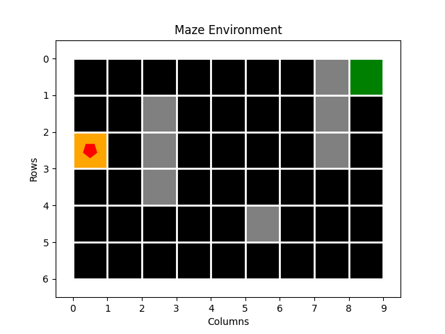
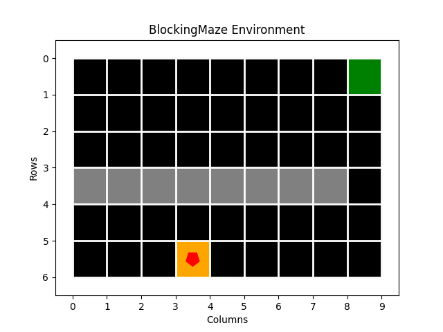
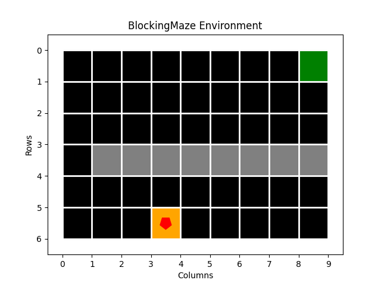
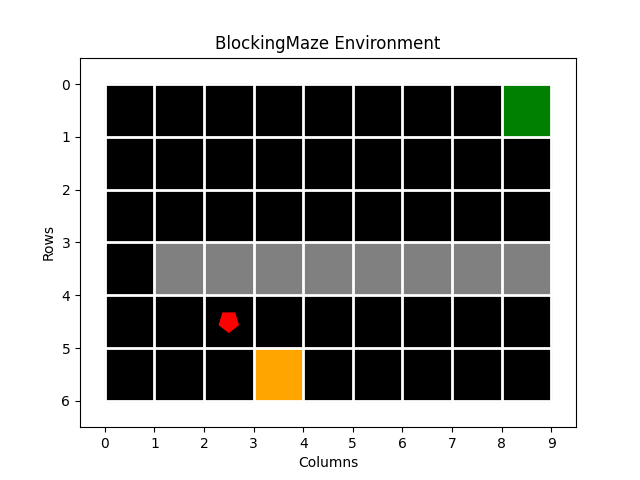
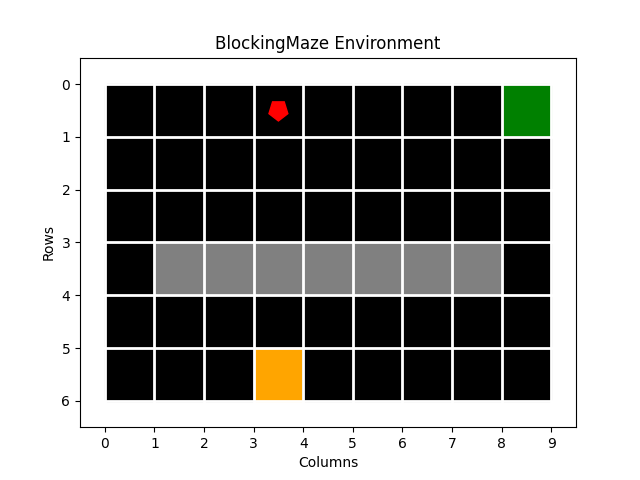
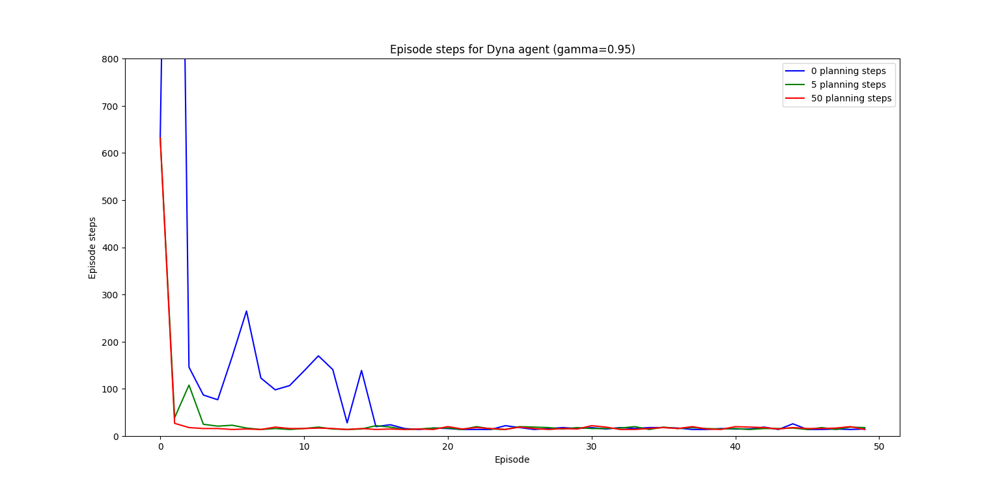
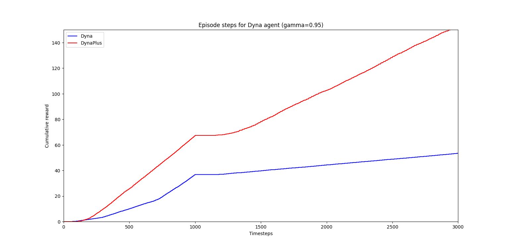
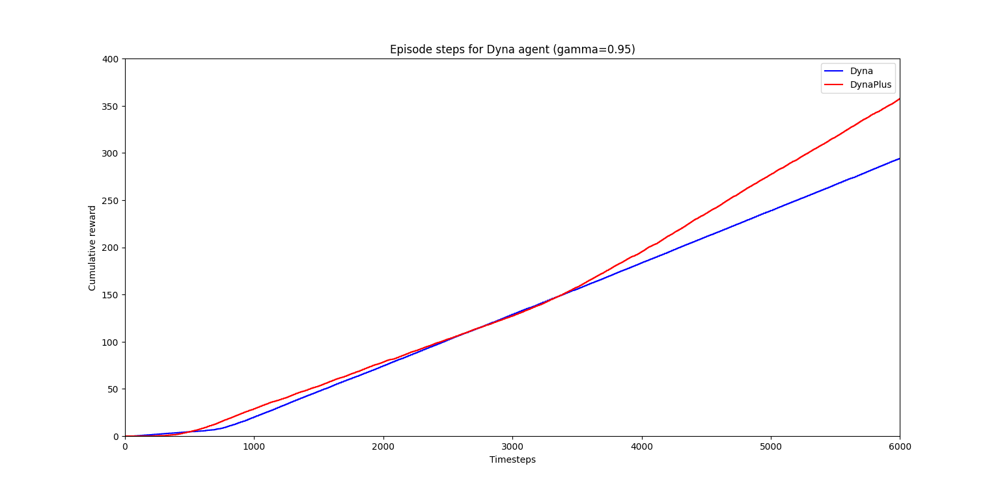

# Assignment: Planning

## Overview

In this assignment, you will implement Planning methods for solving reinforcement learning problems with greater 
sample efficiency.

Algorithms:
- Dyna-Q
- Dyna-Q+

Environments:
- Blocking Maze
- Shortcut Maze

|                 | Simple Maze (Stationary)                           | Blocking Maze (Non-stationary)                                     | Shortcut Maze (Non-stationary)                                     |
| :---: | :---: | :---: | :---: |
| Pre-transition  |  |  |  |
| Post-transition | (same)                                             |  |  |


## Objectives

- Observe Dyna-Q's greater sample efficiency over non-planning Q-learning
- Observe Dyna-Q+'s improvements over Dyna-Q in non-stationary environments

## Files to Work On

- `rl/algorithms/planning/dyna.py`
- `rl/algorithms/planning/dyna_plus.py`

---

## Instructions

### Step 1: Dyna-Q

1. **Complete the `DynaModel` helper class in `dyna.py`:**
   - An instance of this class stores the model of the environment in the main Dyna-Q algorithm.
   - Complete the `add` method to store the transition in the model.
   - Complete the `sample_state_action` method to sample a state-action pair from the model.
2. **Complete the main `DynaQ.learn` method in `dyna.py`:**
   - (`__init__` and `act` methods are already implemented, but inspect them for understanding.)
   - The learn method is left blank (less hand-holding than previous assignments) for you to complete. 
   - Remember, most of the algorithm closely follows Q-learning
3. **Run experiment for the standard Maze:**
   - Execute the script for the initial planning Maze environment:
     ```bash
     python -m rl.experiments.planning.planning_maze_experiment
     ```
   - Can run with different planning step parameters, e.g.:
     ```bash
     python -m rl.experiments.planning.planning_maze_experiment --planning_steps 10 20 30
     ```
   - Can run with different number of episodes, e.g.:
     ```bash
     python -m rl.experiments.planning.planning_maze_experiment --train_episodes 10
     ```

### Step 2: Dyna-Q+

1. **Complete the `DynaPlusModel` helper class in `dyna_plus.py`:**
    - Note, this inherits from `DynaModel`, so most methods already implemented.
    - A new `add` method is required to initialise all possible actions for an encountered state.
    - Complete the `add` method to store the transition in the model.
    - Complete the `sample_state_action` method to sample a state-action pair from the model.
2. **Complete the `TimeSinceLastEncountered` helper class in `dyna_plus.py`:**
    - This implements the tau(s, a) object tracking the time since the last encounter of a state-action pair.
    - (Inherits from `QValueTable`, essentially an S x A NumPy array. Has `get`, `update` methods already implemented.)
    - Complete the `increment` method, which increments non-encountered (s, a) pairs and resets encountered pairs.
3.  **Complete the main `DynaQPlus.learn` method in `dyna_plus.py`:**
    - (`__init__` and `act` methods are already implemented, but inspect them for understanding.)
    - The learn method is left blank (less hand-holding than previous assignments) for you to complete. 
    - Note that `DynaPlus` inherits from the `Dyna` class
    - Note additional attributes for this class: `self.kappa`, `self.time_since_last_encountered`, and the altered `self.model` attribute.
3. **Run experiment for the Blocking Maze:**
     ```bash
     python -m rl.experiments.planning.non_stationary_environments
     ```
4. **Run experiment for the Shortcut Maze:**
      ```bash
      python -m rl.experiments.planning.non_stationary_environments --environment_name ShortcutMaze
      ```
      - N.B. you can run one rather than both algorithm with `--agents Dyna-Q` etc
      - N.B. you can adjust other trial parameters, e.g. `--train_episodes 50 --n_runs 2`
   

## Expected Outputs

### Dyna-Q on standard Maze; planning step sweep



*Standard planning-free Q-learning (blue). Increasing number of planning steps between each real timestep in the 
real environment (real timesteps x-axis) leads to significantly-increased sample-efficiency (--> green --> red)*

### Dyna-Q+ vs Dyna-Q on Blocking Maze



*Increased exploration behaviour of Dyna-Q+ outperforms that of Dyna-Q on the Blocking-maze even before environment 
transition*

### Dyna-Q+ vs Dyna-Q on Shortcut Maze



*Crucially, Dyna-Q+ finds the improved path to the goal after transition, while Dyna-Q stays stuck exploiting the 
old path stored in its model*

---

## Additional Resources

- Sutton & Barto (2018): Reinforcement Learning: An Introduction (Second Edition), Chapter 8
    - Covers the theory behind planning methods
    - Introduces the specific environments used in this assignment
- Planning: Lecture Notes

---
Good luck with your assignment!
