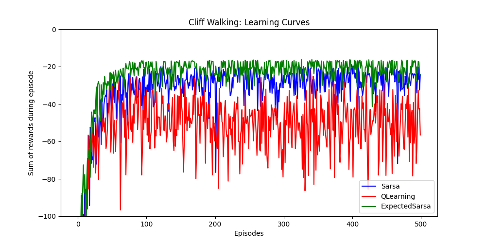
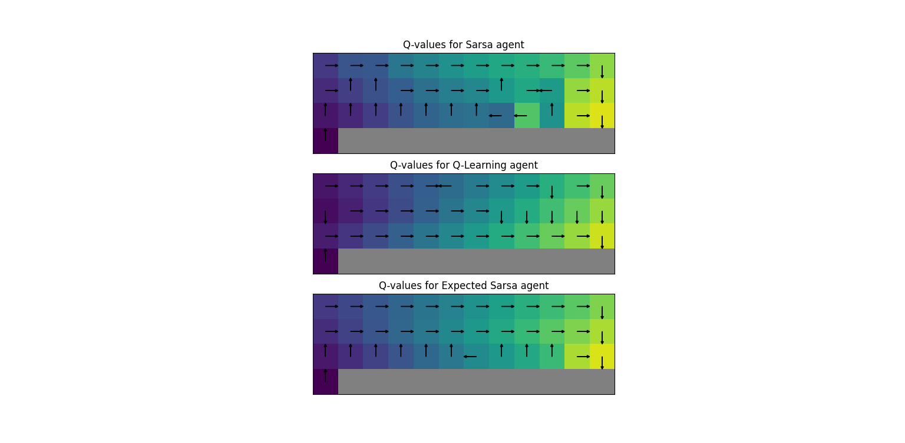

# Assignment: Temporal Difference methods

## Overview

In this assignment, you will implement Temporal Difference methods for solving reinforcement learning problems.

Algorithms:
- SARSA
- Q-learning
- Expected SARSA

Environment:
- Cliff Walking

N.B. the code is more modular than previous assignments.
- Similar methods are extracted to highest level superclasses possible.
- All three Temporal Difference algorithms are tested in a single script, `experiments/temporal_difference/cliff_walking_learning_curves.py`.


## Objectives

- Implement the SARSA algorithm
- Implement the Q-learning algorithm
- Implement the Expected SARSA algorithm
- Understand the more modular structure of the codebase

## Files to Work On

- `rl/algorithms/common/td_agent.py`
- `rl/algorithms/temporal_difference/sarsa.py`
- `rl/algorithms/temporal_difference/q_learning.py`
- `rl/algorithms/temporal_difference/expected_sarsa.py`

---

## Instructions
0. **Inspect**: The approach is now more modular
   - SARSA, Q-learning, and Expected SARSA algorithms are all now tested in a central experiment script at 
     `experiments/temporal_difference/cliff_walking_learning_curves.py`
   - Inspect this script, along with the object it inherits from, `rl.simulation.trial.Trial`
   - Recall from the lecture, in this course a Session is a single traning run of the MDP
   - A Trial is then a set of Sessions, which can be averaged to produce learning curves with greater statistical significance
1. **Implement `TemporalDifferenceAgent.act` in `rl/algorithms/common/td_agent.py`:**
   - This method is common to all three child classes: SARSA, Q-learning, and Expected SARSA, so implement it here.
2. **Implement `Sarsa.learn` in `rl/algorithms/temporal_difference/sarsa.py`:**
   - In this instance, you are guided through the implementation almost line-by-line
3. **Implement `QLearning.learn` in `rl/algorithms/temporal_difference/q_learning.py`:**
   - You are left to implement the entire method yourself; it is very similar to SARSA
4. **Implement `ExpectedSarsa.learn` in `rl/algorithms/temporal_difference/expected_sarsa.py`:**
   - You are left to implement the entire method yourself; it is very similar to SARSA
5. **Run** the experiment on the Cliff Walking environment:
   - Execute the script:
     ```bash
     python -m rl.experiments.temporal_difference.cliff_walking_learning_curves --sessions 30 --episodes_per_session 500
     ```
   - (You can play with the number of sessions and episodes per session to see how the algorithms converge) 


## Expected Outputs



*Learning curves, averaged over 30 runs.*



*A plot of state values (coloured background; dimensions to match environment) and max(action values) (arrows).*

---

## Additional Resources

- Sutton & Barto (2018): Reinforcement Learning: An Introduction (Second Edition), Chapter 6
    - Covers the theory behind temporal difference methods
    - Application of TD methods to Cliff Walking
- Temporal Difference: Lecture Notes

---
Good luck with your assignment!
