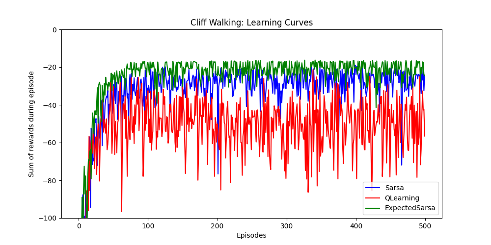
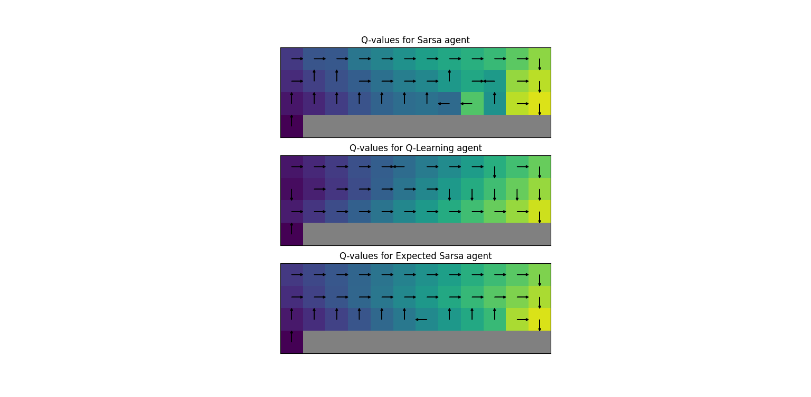

# Assignment: Temporal Difference methods

## Overview

In this assignment, you will implement Temporal Difference methods for solving reinforcement learning problems.

Algorithms:
- SARSA
- Q-learning
- Expected SARSA

Environment:
- Cliff Walking

N.B. the code is more modular than previous assignments.
- Similar methods are extracted to highest level superclasses possible.
- All three Temporal Difference algorithms are tested in a single script, `rl/experiments/temporal_difference/cliff_walking_learning_curves.py`.

## Objectives

- Implement the SARSA algorithm
- Implement the Q-learning algorithm
- Implement the Expected SARSA algorithm
- Understand the more modular structure of the codebase
- Understand how the TD targets differ across the three methods

## Files to Work On

- `rl/algorithms/common/td_agent.py`
- `rl/algorithms/temporal_difference/sarsa.py`
- `rl/algorithms/temporal_difference/q_learning.py`
- `rl/algorithms/temporal_difference/expected_sarsa.py`

---

## Instructions

0. **Inspect**: The approach is now more modular.
   - SARSA, Q-learning, and Expected SARSA algorithms are all tested in a central experiment script at `rl/experiments/temporal_difference/cliff_walking_learning_curves.py`.
   - Inspect this script, along with the object it inherits from, `rl.simulation.trial.Trial`.
   - Recall from the lecture that, in this course, a Session is a single training run of the MDP.
   - A Trial is then a set of Sessions, which can be averaged to produce learning curves with greater statistical significance.
1. **Implement `TemporalDifferenceAgent.act` in `rl/algorithms/common/td_agent.py`:**
   - This method is common to all three child classes: SARSA, Q-learning, and Expected SARSA.
2. **Implement `Sarsa.learn` in `rl/algorithms/temporal_difference/sarsa.py`:**
   - In this instance, you are guided through the implementation almost line-by-line.
3. **Implement `QLearning.learn` in `rl/algorithms/temporal_difference/q_learning.py`:**
   - You are left to implement the entire method yourself; it is very similar to SARSA.
4. **Implement `ExpectedSarsa.learn` in `rl/algorithms/temporal_difference/expected_sarsa.py`:**
   - You are left to implement the entire method yourself; it is very similar to SARSA.
5. **Run** the experiment on the Cliff Walking environment:
   - If you are using `uv`:
     ```bash
     uv run python -m rl.experiments.temporal_difference.cliff_walking_learning_curves --sessions 30 --episodes_per_session 500
     ```
   - If you are using the pip fallback environment from the README, run the same command without `uv run`.

## How the targets differ

This assignment becomes much easier once you keep the three TD targets separate:

- **SARSA** is on-policy. It updates toward the action the current policy actually chose next:
  - `reward + gamma * Q(S', A')`
- **Q-learning** is off-policy. It updates toward the greedy best next action value, even if the behaviour policy explored:
  - `reward + gamma * max_a Q(S', a)`
- **Expected SARSA** is still policy-based, but instead of using one sampled next action, it averages over all next actions under the current policy:
  - `reward + gamma * sum_a pi(a|S') * Q(S', a)`

That expectation term is the only genuinely new idea compared with the SARSA code.

## Expected Outputs



*Learning curves, averaged over 30 runs.*



*A plot of state values (coloured background; dimensions to match environment) and max(action values) (arrows).* 

---

## Additional Resources

- Sutton & Barto (2018): Reinforcement Learning: An Introduction (Second Edition), Chapter 6
  - Covers the theory behind temporal difference methods
  - Application of TD methods to Cliff Walking
- Temporal Difference: Lecture Notes
